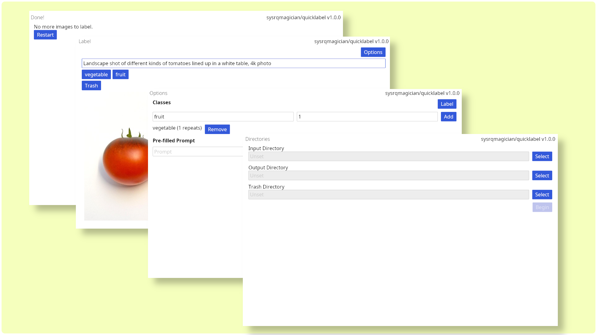

# quicklabel



A fast image labeling tool for creating Text-To-Image finetuning datasets, as taken by the kohya_ss training scripts (dreambooth-style).

## Features

- **Simple Workflow**: Set directories, specify your classes, optionally set pre-filled prompt and repeats, then get to labeling. That's it.
- **Trash Option**: Easily discard unwanted images

## Installation
### From Cargo

```bash
cargo install quicklabel
```

### From Releases

Visit the [Releases page](https://github.com/sysrqmagician/quicklabel/releases) and download the latest executable for your platform.

## Usage

### 1. Directory Setup

First, configure your directories:
- **Input Directory**: Folder containing unlabeled images
- **Output Directory**: Root folder where class directories will be created
- **Trash Directory** (Optional): Where discarded images are moved. If not specified, they will remain in the input directory when discarded.

### 2. Class Configuration

Define your classes:
- Enter a class name and number of repeats
- The output folders will be created as `{repeats}_{class_name}`
- Optionally configure a prompt template that will be pre-filled during labeling

### 3. Image Labeling

Process your images:
- View each image and enter a prompt (or use the pre-filled template)
- Select a class by clicking its button
- Images are moved to the appropriate class folder with matching text files
- Use the "Trash" button to discard unwanted images


## Why make another tool?
There are already a bunch of labeling tools around. Most of them, however, are meant to be used by professionals, who need to be able dynamically change the shape of their dataset, or large teams, who need to collaborate online.
If you're a hobbyist looking to conveniently label some images for a LoRA or similar, these tools are simply too complex. They get in your way.

## License

Copyright © 2025, sysrqmagician <sysrqmagician@proton.me>

Licensed under the terms included in the [LICENSE](LICENSE) file.
